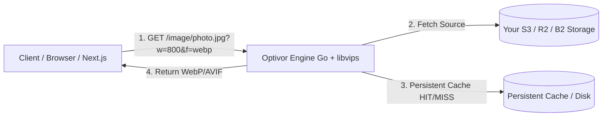

# Optivor

> **High-performance, single-binary image processing & multi-bucket storage proxy built in Go.**
> 
> Stop paying $500/mo for Cloudinary or Next/Image optimization. Connect your existing S3/R2/B2 buckets and handle dynamic WebP/AVIF transformations at scale with zero vendor lock-in.



---

## Why Optivor?

| Feature | Optivor Engine | Cloudinary / ImageKit | Next/Image (Vercel) | imgproxy |
|---|---|---|---|---|
| **Storage Ownership** | BYOS (Yours) | Vendor Locked | Limited | BYOS |
| **Cost at Scale** | Predictable ($0/flat) | High & Dynamic | Sudden Spike Risk | Predictable |
| **Deploy-Proof Cache** | Yes | N/A | No (Lost on deploy) | Manual Setup |
| **Multi-Bucket Routing** | Native | Complex | No | No |
| **Bot / Crawler Shield** | Built-in | Paid Add-on | No | Manual Setup |
| **Single Binary (Go)** | Yes | Cloud Service | Node.js Runtime | Go/C++ |

---

## What is Optivor?

Optivor is an **Open-Source & Self-Hostable Image Infrastructure Framework**.

It is not an image hosting service and does not lock your data into a proprietary CDN. Optivor provides the runtime engine, storage driver interfaces, and deployment tooling to run a production-grade, high-performance image pipeline on top of object storage you already own.

**Bring Your Own Storage. Control Everything Else.**

---

> [!NOTE]
> **Multi-Bucket Routing & Access Control:** Optivor V0.6+ supports multi-bucket declarative routing (`buckets[]`) with per-bucket security policies (`public`, `signed`, `private`) and cross-provider failover chains.
>
> [!NOTE]
> **Persistent Caching & Bot Protection:** V0.9+ introduces deploy-proof persistent cache stores, transparent remote fetching (`/fetch`, `/remote`), and crawler concurrency rate limiting.
>
> [!NOTE]
> **Stateless Scaling & Smart K8s Deployments:** V1.0+ introduces attention/entropy-based Smart Cropping (`fit=smart`), a stateless Redis cache backend for multi-pod scaling, and official Kubernetes Helm Chart deployment adapters.
>
> [!IMPORTANT]
> **DoS Protection Notice:** Enforce reasonable `max_width` and `max_height` values in `optivor.yaml` to prevent decompression-bomb attacks.

---

## 5-Minute Quick Start

### 1. Run Instantly with Docker or Helm (Recommended)

Try Optivor instantly with Docker:

```bash
# Try Optivor instantly with Docker (No Go or libvips required)
docker run -p 8080:8080 -v $(pwd)/optivor.yaml:/etc/optivor/optivor.yaml optivor/optivor:latest
```

Or deploy to a Kubernetes cluster using the official Helm chart:

```bash
helm install optivor ./deploy/helm/optivor
```

For advanced settings, see the [Kubernetes & Helm Deployment Guide](./docs/deployment/kubernetes.md).

#### Advanced: Build from Source (Go Binary)

Ensure `libvips` development headers are installed on your Linux system (`apt install libvips-dev`):

```bash
make build
./bin/optivor -config ./optivor.yaml
```

### 2. Configure `optivor.yaml`

Initialize a new `optivor.yaml` configuration file:

```bash
./bin/optivor init
```

Or configure multi-bucket storage routing and presets:

```yaml
server:
  port: 8080
  read_timeout: 30s
  write_timeout: 30s
  request_timeout: 30s
  log_level: "info"      # debug | info | warn | error
  log_format: "text"     # text | json
  rate_limit:
    enabled: true
    rps: 10
    burst: 20

remote:
  enabled: true
  allowed_domains:
    - "example.com"

presets:
  avatar:
    w: 150
    h: 150
    f: "webp"
    fit: "cover"

buckets:
  - name: "primary-images"
    provider: s3
    endpoint: "https://s3.us-east-1.amazonaws.com"
    bucket: "my-aws-bucket"
    region: "us-east-1"
    access: public

  - name: "secure-assets"
    provider: r2
    endpoint: "https://account-id.r2.cloudflarestorage.com"
    bucket: "my-r2-bucket"
    access: signed
    fallback: "primary-images"

cache:
  fs:
    dir: "/tmp/optivor-cache"
    max_size_mb: 1024

telemetry:
  enabled: true
  service_name: "optivor"
  sampling_ratio: 1.0

image:
  contain_background_color: "#ffffff"
```

### 3. Serve Resized & WebP Converted Images

Request images via single-bucket key, multi-bucket alias, or preset endpoint:

```bash
# Multi-bucket alias route
curl -i "http://localhost:8080/image/primary-images/products/123/main.jpg?w=300&h=300&fit=cover&format=webp"

# Dynamic Preset route
curl -i "http://localhost:8080/preset/avatar/primary-images/users/john.jpg"

# Remote URL Fetching route
curl -i "http://localhost:8080/fetch?url=https://example.com/photo.png&w=600&format=webp"
```

Response returns `Content-Type: image/webp` and `X-Optivor-Cache: MISS` (or `HIT` on subsequent requests).

### 4. Zero-Config Next.js Integration (`@optivor/next`)

Use the official Optivor React component directly in Next.js App Router or Pages Router apps:

```bash
npm install @optivor/next
```

Set your environment variable:

```env
NEXT_PUBLIC_OPTIVOR_URL=https://optivor.example.com
```

```tsx
import { Image } from '@optivor/next';

export default function Page() {
  return (
    <Image
      src="/hero.png"
      width={1200}
      height={800}
      alt="Hero Image"
    />
  );
}
```

### 5. Health Check & Diagnostics

Check system health using `/healthz`, `/health`, or `/healtz` endpoints or running `optivor doctor`:

```bash
curl -i "http://localhost:8080/healthz"
./bin/optivor doctor
```

### 6. Prometheus Metrics

Optivor exposes Prometheus metrics at `GET /metrics`:

```bash
curl -i "http://localhost:8080/metrics"
```

### 7. Storage Driver Management via CLI

Install storage provider drivers from local paths, GitHub repository shorthands, or direct release URLs:

```bash
# Install driver via GitHub repository shorthand
./bin/optivor driver install github:optivor/optivor-driver-r2@v1.2.0

# Install driver via direct HTTPS release URL
./bin/optivor driver install https://github.com/optivor/optivor-driver-r2/releases/download/v1.2.0/optivor-driver-r2-linux-amd64

# List registered drivers
./bin/optivor driver list
```

### 8. Bucket Lifecycle Management via CLI

Manage multi-cloud bucket retention rules:

```bash
./bin/optivor bucket lifecycle list primary-images
./bin/optivor bucket lifecycle set primary-images --ttl-days 30
./bin/optivor bucket lifecycle delete primary-images --all
```

---

## Core Principles

- **Bring Your Own Storage.** Optivor never stores your images. Your data lives in your bucket, under your account, under your control — always.
- **Open-Source & Self-Hostable First.** No vendor lock-in. You own your code, your infrastructure, and your storage.
- **Provider-agnostic by default.** The runtime works on a plain VM or container with nothing but a binary and a config file.
- **Composable, not monolithic.** Storage, transformation, caching, and deployment are independently replaceable.
- **Contributor-first.** You can own an entire piece of this project — a storage driver, a deployment adapter — without needing to understand the whole codebase.

---

## Architecture Overview

```
CLI
  ↓
Runtime (Router, Pipeline & Presets)
  ↓
Storage Drivers (S3, R2, B2, GCS)
  ↓
Object Storage (yours)
```

The runtime knows nothing about cloud providers. Deployment adapters know nothing about image processing. Storage drivers know nothing about either. Each piece does one job.

Full reasoning lives in [`docs/adr/`](./docs/adr).

---

## Documentation

Explore the complete Optivor documentation in [`docs/wiki/`](./docs/wiki):

- [Introduction](./docs/wiki/introduction.md) — Framework overview and philosophy
- [Quick Start Guide](./docs/wiki/quick-start.md) — Setup with Docker and binary
- [Kubernetes & Helm Deployment Guide](./docs/deployment/kubernetes.md) — Production HA Kubernetes setup and Helm reference
- [CLI Reference](./docs/wiki/cli-reference.md) — Command and flag reference
- [Configuration Reference](./docs/wiki/configuration.md) — `optivor.yaml` schema & environment overrides
- [Multi-Cloud & Multi-Bucket Management](./docs/wiki/multi-cloud-management.md) — Multi-bucket configuration & security policies
- [Edge Integration Guide](./docs/wiki/edge-integration.md) — CDN and Cloudflare Workers setup
- [Storage Driver Guide](./docs/wiki/storage-drivers.md) — Building & installing custom storage drivers
- [Storage Driver SDK Specification](./docs/wiki/driver-sdk-specification.md) — Out-of-process IPC protocol specification
- [FAQ](./docs/wiki/faq.md) — Frequently asked questions

---

## Roadmap

See [`ROADMAP.md`](./ROADMAP.md) for completed milestones and future trajectory.

## License

Apache License 2.0. See [`LICENSE`](./LICENSE).
